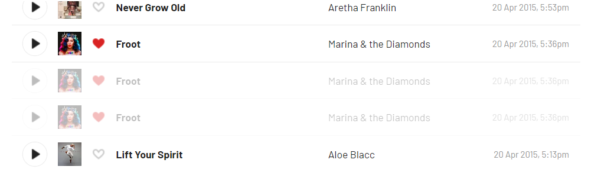

# lastfm-duplicates-remover

### Finding duplicates
At first, it makes sense to find if there are any duplicates in the library at all. You can use [lastfm-tracks-dumper](https://github.com/unrec/lastfm-tracks-dumper) or this [site](http://meaw.kagechiyo.net/web/RemoveDuplicatedTrack.eng.html). If you don't have too much duplicates, it's better to delete it manually by navigating the pages from the generated .csv file.

### Preconditions
The app uses Selenium andChrome browser for deleting Last.fm tracks as currently there is no API for this operation.
Update your Chrome to the latest version and install corresponding [WebDriver](https://chromedriver.chromium.org/downloads).
Deleted tracks can be seen as if they were deleted by you manually:



### Usage
Run the application **.jar** file and provide next parameters:
- Last.fm username (`--user`)
- Last.fm API token (`--token`) (will not be stored or used somewhere else)

```shell
java -jar lastfm-duplicates-remover.jar --user %lastfm_user% --token %lastfm_api_token% --start-page 1818
```

All deleted tracks can be found in `deleted_scrobbles.log` file:

```log
2023-03-05 09:16:09.875 - Processing page 1502
2023-03-05 09:16:15.494 - Duplicate removed: ScrobbledTrack(artist=Peppino Gagliardi, title=Che Vuole Questa Musica Stasera, timestamp=1472724612)
2023-03-05 09:16:15.494 - Duplicate removed: ScrobbledTrack(artist=Bandini, title=L' Estasi Dell'oro, timestamp=1472724119)
2023-03-05 09:16:15.494 - Duplicate removed: ScrobbledTrack(artist=Imany, title=Don't Be So Shy (Filatov & Karas Remix), timestamp=1472723298)
```
